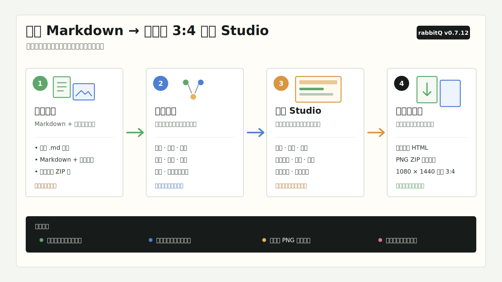
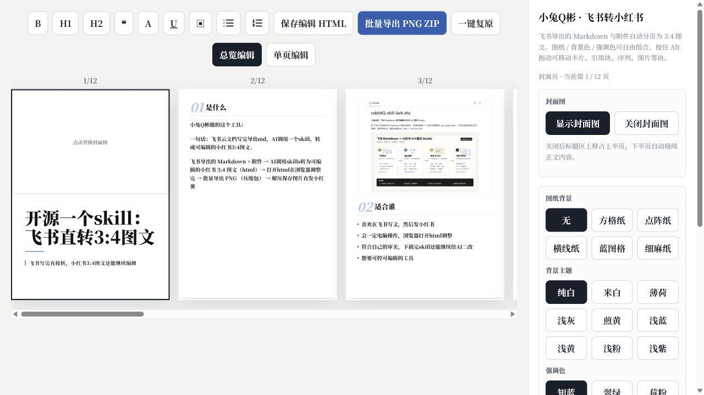

# rabbitQ-skill-lark-xhs

**小兔Q彬 · 飞书 Markdown 转可编辑小红书 3:4 图文 Studio**

把飞书云文档导出的 Markdown 和图片附件，直接转换成一个本地可编辑的 `xhs-studio.html`。默认只生成 HTML；在浏览器里修改文字、封面、图片和样式，确认后再按需批量导出 1080 × 1440 PNG ZIP。





## 为什么做这个 Skill

飞书适合写长文，小红书适合用图片阅读。真正耗时的是把文章拆页、保留层级、安排图片，再逐张调整。

这个 Skill 把中间过程变成一个连续工作流：

1. 飞书导出 Markdown 与附件。
2. 独立解析标题、正文、引用、列表、表格和图片。
3. 按 3:4 页面连续分页。
4. 在本地 Studio 中继续编辑。
5. 保存编辑后的 HTML，或导出全部 PNG。

## 核心能力

- **飞书导出包解析**：支持 `.md`、包含 Markdown 与附件的目录、飞书导出 ZIP。
- **结构化转换**：按文章标题深度映射一级/二级标题，并识别引用、列表、表格、代码块和图片。
- **连续分页**：正文按行跨页；单独一行 `---` 可手动硬断点；图片、卡片等只要放得下就保留在当前页，结构块与长表格按行规则保持完整。
- **封面两种模式**：上图下文，或关闭封面图后用上半页标题、下半页接续正文；副标题支持 AI 总结或手改。
- **可编辑 Studio**：工具栏以 H1 / H2 / B / A / U 等符号呈现并同步点亮当前样式，有序与无序列表使用独立按钮。
- **双模式编辑**：默认横向展示三张 3:4 页面并直接编辑；单击选中页面，双击进入该页放大的单页编辑。
- **固定书刊宋体**：转换前检测并安装 `Noto Serif SC`，所有电脑优先使用同一款书刊宋体；不使用 macOS 私有字体映射。
- **轻量引用**：引用采用透明背景、中性灰竖线和灰色文字，不再使用整块灰底。
- **图片编辑**：替换、删除、拖动裁剪、滚轮缩放、拖拽尺寸、上下移动和左右并排。
- **主题组合**：默认纯白背景 + 知蓝强调色；支持无、方格纸、点阵纸、横线纸、蓝图格、细麻纸，以及浅黄、浅粉、浅紫等背景主题。
- **本地草稿**：编辑自动保存在浏览器；“保存编辑 HTML”可把状态写回独立文件。
- **稳定编辑与完整性保护**：支持中文输入、撤销/重做、序列续写和行内样式叠加；Enter 与 reflow 都会校验前后内容，异常时自动回滚，损坏草稿会恢复安全检查点或源稿并提示。
- **一键复原**：确认后清除当前文章草稿，恢复生成时的内容、图片、主题和布局。
- **批量导出**：一次导出全部 3:4 PNG，并打包为 ZIP。

## v0.8.81 更新

- 拖图片到上一页/下一页的页尾空白时，落点仍是临时 drop cursor，不写入真实空行。
- 若图片框因高度超过目标页剩余空间而再次掉到下一页，Studio 会把图片框收至可用高度，让拖动结果真实落在目标页；文字与图片顺序保持完整。

## v0.8.80 更新

- 正文页尾空白改为 Tiptap / ProseMirror 式 gap cursor：点击只移动临时选择位置，不再生成多行真实空段。
- 拖动空白落点改为视觉 drop cursor；松手只重排区块，空白反馈不会写进正文，也不会把后文挤到后续页面。
- 空页面仍保留一条可直接输入的真实正文行；只有用户按 Enter 创建的空段才参与连续分页。

## v0.8.79 更新

- 图片与结构块的拖动落点从“顶层块边界”升级为真实文档位置：拖进普通正文时可落在字符光标处，并自动把正文拆成前后两段。
- 跨页拖到正文末尾空白时继续按 58px 行网格定位；图片即使当前页放不下，也保留用户选择的内容顺序，再由全文重新分页。
- 移除“图片必须塞进目标页”的强制上移逻辑，插入横线不再反复吸到同一个可容纳位置。

## v0.8.78 更新

- 正文页与正文末尾空白改为 58px 虚拟行交互：点击哪一行，才即时生成到该位置所需的真实可编辑空行并落下光标。
- 标题、卡片、引用、序列、代码块和图片拖进空白区域时，插入线按 58px 行网格吸附；松手后只写入落点前必要的空行。
- 用户通过点击或拖动生成的定位空行在重新分页时保持真实高度，不再被普通页首空段折叠规则吞掉。

## v0.8.77 更新

- 正文页删到完全为空时自动补一条真实可编辑行，点击空白画布即可出现光标并继续输入。
- 页面只剩多个空段时，每个空段都恢复为完整的 58px 正文行，不再因页首/页尾折叠规则全部变成 `0px`。
- 普通跨页正文仍折叠无意义的页首空段，避免下一页首字被空行压到第二行。

## v0.8.76 更新

- 块拖动改成飞书式“源区块轻选中 + 单条插入横线”：移除透明区块克隆、蓝色说明气泡与整页目标描边，落点不会再越出画布盖住设置栏。
- 同页与跨页松手后直接按新的全文顺序重新分页，插入线对应真实落点；补充松手后区块顺序确实改变且内容完整的自动回归测试。
- 继续保留左侧轻量六点手柄与 `Alt + 拖动` 两种入口；序列仍只移动当前项目。

## v0.8.75 更新

- 六点手柄按飞书式轻量外观重做：`18 × 28px` 小控件、六个约 `2.5px` 浅灰点、无厚边框和重阴影；保留 `Alt + 拖动`。
- 拖动时新增精确插入线和半透明区块预览；图片会直接显示预计落下后的尺寸与位置。
- 图片因目标页剩余高度不足而自动上移时，插入线和预览同步显示真正落点，不再只给整页描边。

## v0.8.74 更新

- 撤回可见六点手柄，恢复更干净的 `Alt + 拖动` 区块交互。
- 图片拖到目标页底部但剩余高度不足时，会自动把插入点向该页上方调整，让图片留在目标页，并把后续内容顺延。
- 序列拖动改为只移动当前项目，不再把连续序列整组带走；分页时编号仍与本条正文绑定。

## v0.8.73 更新

- 新增飞书式可见六点区块手柄：悬浮标题、卡片、引用、代码块、表格、序列或图片后，直接按住左侧手柄拖动；当前页与跨页重排都不再需要 `Alt`。
- 连续序列仍按整组移动；图片框内普通拖动继续只调整裁剪位置，避免“移动图片”和“移动图片块”混淆。

## v0.8.72 更新

- 对齐飞书的块级拖动：总览编辑中可把标题、卡片、引用、代码块、表格、序列和图片跨页 `Alt + 拖动`；连续序列按整组搬动，不拆散编号。
- 修复关闭封面图后执行图片移动、并排或块级重排时，封面下半页正文可能被旧的“仅正文页”收集路径漏掉的问题；现在所有操作都基于同一条连续内容流重新分页。

## v0.8.71 更新

- 总览编辑支持图片跨页 `Alt + 拖动`：拖到另一正文页后按目标位置写回全局内容流并自动重新分页，移动后图片继续保持选中。
- 对齐飞书的序列退格：第二项第一次 Backspace 退回正文，第二次 Backspace 会并入第一项正文，不会重新生成第二个序号。
- 正文紧跟引用、卡片或代码块时，在段首 Backspace 会并入前一个块的正文位置；卡片不再被浏览器当成整块选中删除。

## v0.8.70 更新

- 修复序列退回正文后的连续删除：在非空序列项开头第一次按 Backspace 只去掉序号，光标会在重排后稳定保留在正文开头；紧接着第二次 Backspace 按普通正文规则继续向前合并，包括跨页边界。
- 修复 reflow 恢复光标后再次规范化正文节点造成的选区丢失，连续输入与删除不再被自动分页打断。

## v0.8.69 更新

- 明确正文、序列与结构块的分页边界：普通正文按字符/行连续跨页；序列可在完整项目之间跨页，但编号与该项正文保持绑定；标题、引用、卡片、代码块、图片和短表格在空间不足时整块换页。仅超出整页的长表格按完整数据行拆分。
- 正文改为真正的跨页连续编辑：光标位于分页续写首字前时，Backspace 会作用到上一页末尾字符，并围绕新光标位置重新分页。
- 在引用、卡片、标题等结构块开头按 Enter，会在连续流中插入真实空段；结构块完整移到下一页时，光标和空段留在上一页，不再被重排删除。
- Enter、Backspace、序列退回正文和块边界 `+ / −` 都会触发全局回流，分页只负责显示，不再成为编辑边界。

## v0.8.66 更新

- 正文仍默认使用 720 加粗字重；选中文字点击 `B` 可切换为 700 不加粗，再点一次恢复 720。
- 工具栏会按当前选区显示状态：默认 720 时 `B` 点亮，700 不加粗时熄灭，混合选区显示混合态。

## v0.8.65 更新

- 代码正文从 28px 调整为 32px，行高同步调整为 1.55，内容区内边距按新字号适配。
- macOS 三色圆点保留原尺寸、颜色与间距，并通过顶部栏的垂直居中规则保证三个圆心处于同一水平线。

## v0.8.64 更新

- 代码块按钮改为与卡片一致的选区逻辑：普通正文必须先选中同一段内的有效文字，跨段或整页选区不再被整体转换成代码块。
- 已有标题、卡片、引用、序列和代码块仍可通过块样式按钮原地互切；macOS 三色圆点在工具栏内保持同一水平中心线。

## v0.8.63 更新

- 新增 `node scripts/ensure-font.js`：转换前检测 `Noto Serif SC`，macOS 缺失且有 Homebrew 时自动安装官方 `font-noto-serif-sc` cask。
- 撤掉 macOS 私有 `STSongti-*` 字形映射，恢复 GitHub 原版以 `Noto Serif SC` 为第一优先级的字体栈，减少跨电脑显示差异。

## v0.8.62 更新

- 正文统一使用 `720` 加粗字重。

## v0.8.61 更新

- 统一正文语义：普通正文固定 `700`，Markdown `**加粗**` 固定 `720`。
- Markdown 加粗不再自动叠加浅蓝下划线；下划线只由原稿明确样式或工具栏手动添加，避免同为加粗标签却看起来粗细不一。
- `B` 按钮只在明确的加粗内容里点亮，不再把普通 `700` 正文误判为已加粗。

## v0.8.60 更新

- 修复跨页空行：页首/页尾的手动空行保留编辑语义但不再显示成空白首行；删掉空行后，下一页正文会重新回填上一页。
- 一级标题改为统一的两位数字占位，`01 / 02 / 03` 与标题始终保持固定间隔。
- 新增 fenced code Markdown 识别和可编辑的 macOS 三色圆点代码块。
- PNG 改用 2 倍分辨率渲染后高质量缩回 1080 × 1440，改善字体边缘清晰度。
- 自动移除源稿末尾常见的“部分内容可能由 AI 生成”引用声明，普通引用不受影响。

## v0.8.59 更新

- 修复一级、二级标题孤行：标题会和紧随的正文、引用、卡片、序列等内容保持同页，不再单独挂在上一页底部。

## v0.8.58 更新

- 正文编辑统一采用飞书式段落逻辑：`Shift + Enter` 段内换行，`Enter` 新建段落，连续回车保留可编辑的空段落。
- 空段落按真实正文顺序参与分页，不再被重排到其他内容前方或在页边界静默删除。
- 修复普通正文和列表开头无法用 `Backspace` / `Delete` 删除相邻空段落的问题。

## v0.8.57 更新

- 修复总览编辑时在封面副标题或正文中按 `Enter` / `Shift+Enter` 会误切到单页编辑的问题。
- 双击可编辑文字现在用于正常选词；双击非当前页仍会进入对应页面的单页编辑。

## v0.8.56 更新

- 修复连续列表分页时重复计算末项间距的问题，避免列表后仍能放下的图片被提前推到下一页。

## v0.8.55 更新

- 新增三页横向总览编辑，单击选页、双击进入单页编辑。
- 工具栏使用 H1 / H2 与标准列表图标，并同步显示当前文字和块样式。
- 恢复独立的有序、无序列表操作，优化中文连续输入、撤销重做和序列续写。
- 修复标题编号占位、块间距叠加和图片提前分页；新增细麻纸及浅黄、浅粉、浅紫背景。

## 快速开始

### 1. 安装

```bash
git clone https://github.com/rabbit-Qbin/rabbitQ-skill-lark-xhs.git
cd rabbitQ-skill-lark-xhs
npm ci
```

作为 Codex Skill 安装时，将仓库放到：

```text
~/.codex/skills/rabbitQ-skill-lark-xhs/
```

### 2. 准备飞书导出包

```text
文章目录/
├── 文章.md
└── 图片和附件/
    ├── image.png
    └── image 1.png
```

Markdown 文件里的图片路径应指向附件目录。路径中包含空格或中文没有关系。

### 3. 生成 Studio

```bash
node scripts/convert.js "/path/to/文章目录"
```

也可以直接传 Markdown 或 ZIP：

```bash
node scripts/convert.js article.md
node scripts/convert.js lark-export.zip
node scripts/convert.js article.md -o "/path/to/output-xhs"
```

### 4. 编辑与导出

打开输出目录中的 `xhs-studio.html`。它可以直接通过 `file://` 运行，不需要启动本地服务器。

## 输入映射

| Markdown / 飞书结构 | Studio 结果 |
|---|---|
| `# 标题` 或 frontmatter `title` | 封面主标题（不重复进正文） |
| frontmatter `subtitle` 或 AI 传入的 `--subtitle` | 封面副标题 |
| 文章里最少的那种 `#`（排除封面后） | 一级标题：01 / 02 编号 + 通栏分隔线 |
| 文章里第二少的那种 `#` | 二级标题：强调色字 + 2px 浅色下划线（字号比一级小 20% 后再 +2px） |
| 更深的标题 | 加粗正文段落 |
| 普通段落 | 可跨页正文 |
| 整段加粗或明确的「高亮/划重点/卡片/注意/结论/金句/关键/判断/提醒/重点」 | 卡片块 |
| `> 引用` | 斜体引用块 |
| fenced code（如 <code>```js</code>） | macOS 三色圆点可编辑代码块 |
| `- 项目` / `1. 项目` | 无序 / 有序序列 |
| GFM pipe table / HTML `<table>` | 浅强调色表头、白底正文的可编辑表格块 |
| `` | 可编辑图片块 |
| 视频链接或视频附件 | 跳过，并在 Studio 顶部提示 |

转换器会优先尊重 Markdown 的结构，不会因为引用里出现“金句”、列表里出现“卡片”等词就误判类型。表格必须具备表头和 Markdown 分隔行，普通文本里偶然出现竖线不会被误判。

## Studio 操作

### 文字

- `H1` / `H2` / `❝` / `▣` / `</>` / 无序列表图标 / 有序列表图标：选中文字后应用对应块样式。`</>` 会生成 macOS 风格代码窗口；光标在已有块里再点**同一个**按钮可取消回正文。
- `有色字` / `下划线`：选中文字后使用当前强调色；可与加粗、序列等样式叠加，再点一次取消。
- 块边界 `+ / −`：悬浮一级/二级标题、卡片、引用、序列或图片时，每次增加或减少一行相邻空白。
- 有序/无序列表在 Enter 拆分后继续保留类型、粗体和光标后的全部文字。
- `Ctrl/Cmd + Z` 撤销；`Ctrl + Y` 或 `Cmd + Shift + Z` 重做。

### 图片

- 单击选中图片；双击可在本地选择文件替换。
- 选中后按 `Delete` / `Backspace` 删除。
- 拖动图片调整裁剪中心，滚轮控制缩放。
- 蓝色边框控制图片框宽度和高度。
- 支持块级上移、下移、与前后图片并排、拆成上下排列。
- 连续竖图会在初次转换和重新布局时自动并排。

### 保存、复原和导出

- 浏览器会自动保存当前文章草稿。
- `保存编辑 HTML` 会下载包含当前编辑状态的新 HTML。
- `一键复原` 会清除当前文章的本地修改并恢复初始状态。
- `批量导出 PNG ZIP` 会用 2 倍画布渲染后高质量缩回标准尺寸，再按当前预览导出所有页面；只在确认需要出图时点击即可。

## 分页原则

- 画布默认是 `1080 × 1440`，比例固定为 `3:4`。
- 内容按一个连续长文流排列，再切成多页。
- 普通正文可按行拆分，避免整段被推到下一页。
- 一级/二级标题、引用、卡片、列表、短表格和图片默认不从中间截断；长表格只按完整数据行跨页并重复表头。
- 关闭封面图时，正文只会按原顺序填入封面下半页，不会跳过放不下的块。
- 图片和卡片后的光标锚点不占版面高度，但仍可点击插入文字。

## 命令参数

```text
-o, --output-dir <dir>   指定输出目录
--title <text>           覆盖封面标题
--subtitle <text>        指定封面副标题
--size <WxH>             指定 3:4 画布，默认 1080x1440
--width <px>             指定宽度
--height <px>            指定高度
--help                   查看帮助
```

## 输出

```text
文章-xhs/
├── xhs-studio.html
└── manifest.json
```

PNG 导出文件名为 `01.png`、`02.png`……，所有页面尺寸一致。

## 隐私与限制

- Markdown、图片、编辑草稿和导出过程都在本机完成。
- Studio 不会自动上传内容到小红书。
- 小红书图文只使用图片；视频会被跳过并提示用户另行上传或先截帧。
- 副标题最多按 48 个中文字符权重处理，最多显示两行。
- “一键复原”会删除当前文章的本地编辑草稿，操作前会确认。

## 开发与验证

```bash
npm ci
npm test
node --check scripts/convert.js
```

发布前应再用真实飞书导出包验证：引用识别、封面开关、页面溢出、图片编辑，以及 PNG ZIP 与预览的一致性。

更详细的编辑说明见 [docs/xhs-tool-intro.md](docs/xhs-tool-intro.md)，输入约定见 [references/markdown-patterns.md](references/markdown-patterns.md)，布局约定见 [references/layout-spec.md](references/layout-spec.md)。

## 作者

小兔Q彬 / [rabbitQ](https://github.com/rabbit-Qbin)
