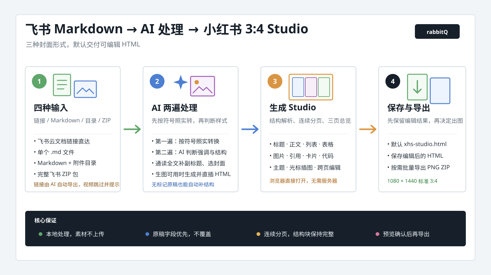

# rabbitQ-skill-lark-xhs

**小兔Q彬 · 飞书 Markdown 转可编辑小红书 3:4 图文 Studio**

把飞书云文档导出的 Markdown、图片附件或完整 ZIP，转换成一个可在浏览器里继续编辑的 `xhs-studio.html`。默认只生成 HTML；确认排版后，再按需批量导出 1080 × 1440 PNG ZIP。

当前版本：**v0.9.10**



## 它解决什么

飞书适合写长文，小红书需要逐页图文。这个 Skill 负责中间最费时间的一段：

```text
飞书 Markdown + 附件
→ 解析标题、正文、列表、引用、卡片、表格、代码块和图片
→ 自动排成连续的 3:4 页面
→ 在本地 Studio 中继续编辑
→ 按需导出全部 PNG
```

所有正文、图片、草稿和导出都在本机处理，不会自动上传到小红书。

## 核心能力

- **三种输入**：支持单个 `.md`、包含 Markdown 与附件的目录、飞书导出 ZIP。
- **三种封面形式**：全封面、半封面、无封面可随时互切；半封面默认采用左短字、右 IP/主题主视觉，AI 图片可通过 `--cover-image` 直接嵌入 Studio。
- **自动副标题**：原稿未提供副标题时，AI 通读全文后补一句最多两行的封面副标题；已有字段不会被覆盖。
- **结构化转换**：识别正文标题、引用、卡片、有序/无序列表、表格、代码块和图片。
- **连续分页**：正文按内容流跨页，结构块尽量保持完整；单独一行 `---` 可强制换页。
- **总览连续编辑**：只保留横向总览，同时查看三张 3:4 页面，点击任意页即可在原位置编辑。
- **文字与样式**：支持 H1、H2、加粗、有色字、下划线、引用、卡片、代码块和列表互切或叠加。
- **图片编辑**：可在光标处插图或直接粘贴；粘贴图片会按比例给出适合图文页面的初始尺寸，也可替换、删除、裁剪、缩放、调尺寸、上下移动、跨页拖动和并排。
- **主题组合**：支持无、方格纸、点阵纸、横线纸、蓝图格、细麻纸，以及多种背景色和强调色。
- **本地草稿**：自动保存编辑状态，支持撤销、重做、一键复原和保存编辑后的 HTML。
- **批量导出**：按当前预览一次导出全部 1080 × 1440 PNG，并打包为 ZIP。

## 快速开始

### 1. 安装依赖

```bash
git clone https://github.com/rabbit-Qbin/rabbitQ-skill-lark-xhs.git
cd rabbitQ-skill-lark-xhs
npm ci
```

作为 Agent Skill 使用时，将仓库目录安装到对应的 `skills` 目录，并确保 Skill 名为 `rabbitQ-skill-lark-xhs`。

### 2. 准备输入

```text
文章目录/
├── 文章.md
└── 图片和附件/
    ├── image.png
    └── image 1.png
```

图片路径可以包含中文和空格。也可以直接传入 Markdown 文件或完整 ZIP。

### 3. 生成 Studio

```bash
node scripts/convert.js "/path/to/文章目录"
```

其他常用写法：

```bash
node scripts/convert.js article.md
node scripts/convert.js lark-export.zip
node scripts/convert.js article.md -o "/path/to/output-xhs"
```

直接嵌入封面图：

```bash
node scripts/convert.js article.md \
  --subtitle "从飞书 Markdown 到 3:4 图文，排版终于能自己控了" \
  --cover-mode full \
  --cover-image "/path/to/cover.png"
```

`--cover-image` 支持 PNG、JPG/JPEG、WebP 和 GIF。图片会嵌入 HTML，移动输出目录后仍能正常显示。

### 4. 编辑与导出

打开输出目录中的 `xhs-studio.html`。它可以直接通过 `file://` 运行，不需要本地服务器。

默认停在可编辑预览，不会自动导出图片。确认需要成图时，再点击“批量导出 PNG ZIP”。

## AI 调用时的默认流程

当用户让 AI 调用本 Skill 转图文时：

1. 通读源 Markdown，并优先使用原稿已有的标题和副标题。
2. 缺少副标题时，AI 根据全文补一句简短总结。
3. 让用户选择全封面、半封面或无封面。
4. 全封面生成前确认最终标题和副标题，图片规格为 1080×1440；半封面图片规格为 1080×720；无封面不生成图片。
5. 未指定画风时：全封面默认生成“主题配图 + 已确认标题/副标题”；半封面默认生成无文字主视觉，标题和副标题留在 Studio 下半页编辑。仅用户明确要求，或文章是工具流程/品牌介绍时，半封面才使用“左字右图”的横幅构图。
6. 用户希望加入 IP 时，可询问是否提供参考图；未提供时按主题生成。来源/去向 Logo 仅用于明确的转换流程、工具介绍或用户点名要求。
7. 需要 AI 配图时先检查当前会话是否具备生图能力；不可用则如实说明，并改用用户本地图、现有素材或先交付半封面/无封面的可编辑 HTML。
8. 生成 `xhs-studio.html`，返回本地文件路径和采用的封面形式、副标题。
9. 只有用户明确要求导出、验收或准备发布时，才导出 PNG ZIP。

## 封面字段

原稿可以直接指定封面，不需要 AI 猜：

```yaml
---
title: 飞书云文档转 3:4 图文 Skill
subtitle: 写完直接转，还能继续编辑
---
```

也支持文首中文标签：

```markdown
标题：飞书云文档转 3:4 图文 Skill
副标题：写完直接转，还能继续编辑
```

优先级为：

```text
CLI 参数 > frontmatter > 文首中文标签 > 文档标题 / AI 补充
```

## Markdown 映射

| Markdown / 飞书结构 | Studio 结果 |
|---|---|
| `title` / `标题：` / 首个主标题 | 封面大标题 |
| `subtitle` / `副标题：` / `--subtitle` | 封面副标题 |
| 正文最浅标题层级 | 一级标题：两位编号 + 通栏线 |
| 正文第二浅标题层级 | 二级标题：强调色 + 下划线 |
| 更深标题 | 加粗正文 |
| 普通段落 | 可编辑、可跨页正文 |
| 单独一行 `---` | 手动分页 |
| `> 引用` | 引用块 |
| fenced code | macOS 风格代码块 |
| `- 项目` / `1. 项目` | 无序 / 有序列表 |
| GFM 表格 / HTML `<table>` | 可编辑表格 |
| Markdown 图片 | 可编辑图片块 |
| 视频链接或附件 | 跳过并提示另行处理 |

转换器优先尊重 Markdown 结构，不会因为引用或列表里出现“金句”“卡片”等词就误判块类型。

## Studio 操作

### 文字与结构

- 工具栏会根据当前光标或选区点亮已有样式。
- 块样式可以直接互切；再次点击同一个按钮可取消回正文。
- 有色字和下划线只作用于选中文字，可与加粗、列表等样式叠加，再点一次取消。
- `Shift + Enter` 为段内换行，`Enter` 新建段落。
- `Ctrl/Cmd + Z` 撤销；`Ctrl + Y` 或 `Cmd + Shift + Z` 重做。
- 标题、引用、卡片、列表、代码块和图片可通过手柄或 `Alt + 拖动` 调整位置。

### 图片

- 顶部图片按钮可把本地图片插入当前正文光标位置。
- 从剪贴板粘贴图片时，横图、竖图和常规图片会按原始比例给出不同的初始宽度与高度；仍可在右栏继续调整。
- 双击图片可替换；单击选中后可删除。
- 拖动调整裁剪中心，滚轮控制缩放，边框控制图片框宽高。
- 支持上下移动、跨页拖动、与前后图片并排或拆回上下排列。

### 封面与主题

- 封面支持三种形式：全封面独占首张；半封面上图、下标题；无封面上标题、下半页续正文。
- 封面标题最多三行，副标题最多两行。
- 图纸、背景色、强调色和封面占位色可以自由组合。
- 全局优先使用 `Noto Serif SC` 书刊宋体；转换前可运行 `node scripts/ensure-font.js` 检查字体。

## 命令参数

```text
-o, --output-dir <dir>   指定输出目录
--title <text>           覆盖封面标题
--subtitle <text>        指定封面副标题
--cover-image <file>     转换时嵌入本地封面图
--cover-mode <mode>      full（全封面）/ half（半封面）/ none（无封面）
--keywords <a,b,c>       兼容保留的关键词元数据
--size <WxH>             指定 3:4 画布，默认 1080x1440
--width <px>             指定画布宽度
--height <px>            指定画布高度
--help                   查看帮助
```

## 输出

```text
文章-xhs/
├── xhs-studio.html
└── manifest.json
```

PNG 导出文件按 `01.png`、`02.png`……排序，每页标准尺寸为 1080 × 1440。

## 隐私与限制

- 内容、图片、草稿和导出过程都在本机完成。
- Studio 不会自动上传或发布到小红书。
- 视频不会放入图文，需要另行上传或先截帧。
- “一键复原”会清除当前文章的本地编辑草稿，操作前会确认。

## 开发与验证

```bash
npm ci
npm test
node --check scripts/convert.js
```

更详细的编辑说明见 [docs/xhs-tool-intro.md](docs/xhs-tool-intro.md)，输入约定见 [references/markdown-patterns.md](references/markdown-patterns.md)，布局约定见 [references/layout-spec.md](references/layout-spec.md)。

## 作者

小兔Q彬 / [rabbitQ](https://github.com/rabbit-Qbin)
